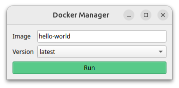

# Docker Manager

Utility for launching Docker containers from a GUI



## Usage

* Type an image name
* Select a version (tag) for the image
* Press the button to run the container
* Press the button a second time to stop the container

## Customization

Users can customize the widget by overloading the ``DockerManagerWidget.create_containers`` method and invoking the Docker client ``containers.run()`` method.
The ``utils`` module provides several common sets of keyword arguments to provide to the client's ``containers.run()`` method for launching containers with X11 support, as a non-root user, with access to USB devices, etc.

## Packaging

Using [``pyinstaller``](https://pyinstaller.org/en/stable/index.html) we can build a single executable file for the GUI provided in this repository using the command below:

```bash
cd <path/to/docker_manager>
pyinstaller --onefile --add-data="docker_manager/docker_manager_widget.ui:docker_manager" scripts/docker_manager
```

> Note: the ``--add-data`` option is required because ``pyinstaller`` with otherwise not include the Qt ``.ui`` file which is required at run-time for the GUI